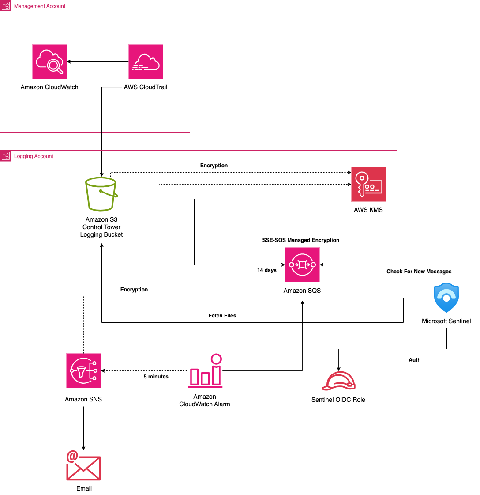

## Ingest and analyze AWS Security Logs in Microsoft Sentinel

This pattern describes how to automate the ingestion of security logs, e.g., AWS CloudTrail, Amazon CloudWatch Logs, AWS VPC Flow Logs and Amazon GuardDuty, in Microsoft Sentinel to centrally monitor, detect and analyze security related events and logs. The logs are automatically ingested as soon as available in an Amazon S3 bucket in less than 5 minutes reducing the time to detect security events.

AWS CloudTrail logs are ingested in Microsoft Sentinel in a tabular format with the original timestamp when the event was recorded. The structure format of the ingested logs enables query capabilities with the Microsoft Sentinel Kusto Query Language.

The pattern deploys a monitoring and alerting solution to detect ingestion failures in less than 1 minute with a notification system that can be monitored by the external SIEM. Resources are deployed in the logging account with AWS CloudFormation.

### Target audience

This pattern is recommended for users who have experience with AWS Control Tower, AWS Organizations, AWS CloudFormation, AWS IAM and AWS KMS.

## Prerequisites and limitations
### Prerequisites

#### The prerequisites to meet before for the deployment of this pattern are below.

- Active AWS accounts managed as an organization with a logging account in AWS Organizations and an AWS Control Tower landing zone. For instructions, see [Create an account structure](https://www.wellarchitectedlabs.com/cost/100_labs/100_1_aws_account_setup/2_account_structure/) (AWS Well-Architected Labs).

- AWS CloudTrail configured for the whole organization and AWS CloudTrail logs stored in Amazon S3 in the logging account.

- Permissions to assume an existing AWS Identity and Access Management (IAM) role in the logging account with the permissions to deploy the resources defined in the provided CloudFormation template.

- Permissions required to deploy the provided AWS CloudFormation template in the logging account.

- Permissions to modify the AWS KMS key policy if the logs are encrypted with a customer managed key (CMK).

- AWS Command Line Interface (AWS CLI), [installed](https://docs.aws.amazon.com/cli/latest/userguide/getting-started-install.html) and [configured](https://docs.aws.amazon.com/cli/latest/userguide/cli-configure-files.html).

- Microsoft Azure account with a subscription to use Microsoft Sentinel.

### Limitations 

- This pattern provides instructions for deploying this solution in the logging account to ship the security logs from an Amazon S3 bucket in the logging account to Microsoft Sentinel. Instruction on how to ship the logs to Amazon S3 are not explicitly provided.

- This pattern provides instructions for an AWS Control Tower landing zone but can we be used also without AWS Control Tower. The pattern is compatible with an environment where the Amazon S3 logging bucket is restricted with [SCPs](https://docs.aws.amazon.com/organizations/latest/userguide/orgs_manage_policies_scps.html), such as [Disallow Changes to Bucket Policy for AWS Control Tower Created Amazon S3 Buckets in Log Archive](https://docs.aws.amazon.com/controltower/latest/controlreference/mandatory-controls.html#disallow-policy-changes-s3-buckets-created).

- This pattern provides instructions for logs stored in Amazon S3 with the example of AWS CloudTrail logs but can be easily adapted to ship all other logs supported by Microsoft Sentinel, such as, Amazon CloudWatch Logs, AWS VPC Flow Logs and Amazon GuardDuty Logs.

- This pattern provides instructions using the AWS CLI but it can also be deployed [Using the AWS CloudFormation console](https://docs.aws.amazon.com/AWSCloudFormation/latest/UserGuide/cfn-using-console.html).

- This pattern deploys an Amazon SQS queue to deliver Amazon S3 notifications encrypted using SSE-SQS encryption. The queue will contain pointers to objects uploaded in the Amazon S3 logging bucket not actual data. If you want to encrypt the SQS queue with SSE-KMS you can use a customer managed key following the documentation [Encryption at rest in Amazon SQS](https://docs.aws.amazon.com/AWSSimpleQueueService/latest/SQSDeveloperGuide/sqs-server-side-encryption.html).

## Architecture
### Target architecture

This section provides a high-level overview of the solution and the architecture established by the sample code. The following diagram shows the resources deployed in the logging account to ingest the logs from an existing S3 bucket to Microsoft Sentinel.

AWS Control Tower helps you setup the foundational OU structure and centralization of AWS CloudTrail logs in the logging account. It also implements mandatory security controls (SCPs) to protect the logging bucket.

We have provided the target architecture in an AWS Control Tower landing zone but this is not strictly required. The resources in the management account are an example of AWS Control Tower deployment with AWS CloudTrail setup for the whole organization.

This pattern focus on the deployment of resources in the logging account but for an AWS Control Tower landing zone with logs encrypted with a customer managed key (CMK) the key policy must be updated to allow Microsoft Sentinel to decrypt the logs. The key policy configuration in an AWS Control Tower landing zone is done in the management account where the key has been created.

## Security

See [CONTRIBUTING](CONTRIBUTING.md#security-issue-notifications) for more information.

## License

This library is licensed under the MIT-0 License. See the LICENSE file.
