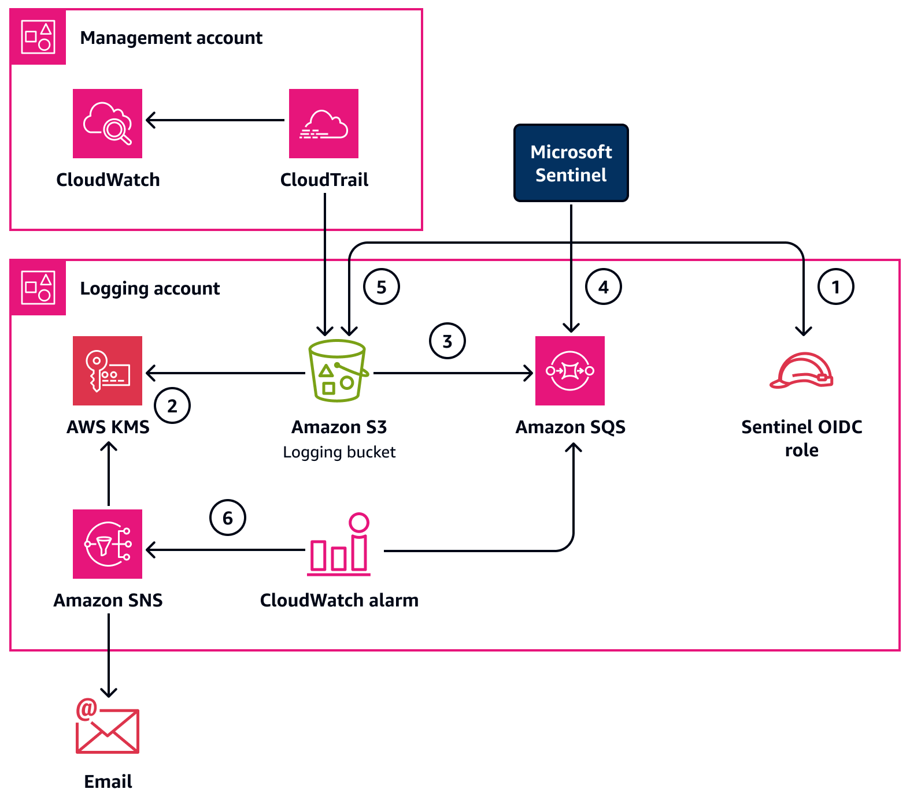

## Ingest and analyze AWS Security Logs in Microsoft Sentinel

This pattern describes how to automate the ingestion of AWS security logs, such as AWS CloudTrail logs, Amazon CloudWatch Logs data, Amazon VPC Flow Logs data, and Amazon GuardDuty findings, into Microsoft Sentinel. If your organization uses Microsoft Sentinel as a security information and event management (SIEM) system, this helps you centrally monitor and analyze logs in order to detect security-related events. As soon as the logs are available, they are automatically delivered to an Amazon Simple Storage Service (Amazon S3) bucket in less than 5 minutes. This can help you quickly detect security events in your AWS environment.

Microsoft Sentinel ingests CloudTrail logs in a tabular format that includes the original timestamp for when the event was recorded. The structure of the ingested logs enables query capabilities by using [Kusto Query Language](https://learn.microsoft.com/en-us/azure/sentinel/kusto-overview) in Microsoft Sentinel.

The pattern deploys a monitoring and alerting solution that detects ingestion failures in less than 1 minute. It also includes a notification system that the external SIEM can monitor. You use AWS CloudFormation to deploy the required resources in the logging account.

The code in this repository helps you set up the following target architecture.

For prerequisites and instructions for using this AWS Prescriptive Guidance pattern, see [Ingest and analyze AWS security logs in Microsoft Sentinel](https://docs.aws.amazon.com/prescriptive-guidance/latest/patterns/ingest-analyze-aws-security-logs-sentinel.html).

### Target audience

This pattern is recommended for users who have experience with AWS Control Tower, AWS Organizations, CloudFormation, AWS Identity and Access Management (IAM), and AWS Key Management Service (AWS KMS).

## Security

See [CONTRIBUTING](CONTRIBUTING.md#security-issue-notifications) for more information.

## License

This library is licensed under the MIT-0 License. See the LICENSE file.
